# Domain Model

This diagram describes the initial Cratebase domain model. It is intentionally centered on domain concepts and typed identifiers, not EF Core, API contracts, or database schema.

When the domain model changes, update this diagram in the same pull request.

```mermaid
classDiagram
    direction LR

    namespace SharedKernel {
        class IEntity~TId~ {
            <<interface>>
        }

        class INamedEntity {
            <<interface>>
            string Name
        }

        class IArtist {
            <<interface>>
            ArtistId ArtistId
        }

        class ICreditContributor {
            <<interface>>
        }

        class ICreditTarget {
            <<interface>>
        }

        class DomainException

        class ArtistId {
            Guid Value
        }

        class PersonId {
            Guid Value
        }

        class GroupId {
            Guid Value
        }

        class LabelId {
            Guid Value
        }

        class ReleaseId {
            Guid Value
        }

        class TrackId {
            Guid Value
        }

        class OwnedItemId {
            Guid Value
        }

        class CreditId {
            Guid Value
        }

        class ArtistRelationId {
            Guid Value
        }

        class TrackRelationId {
            Guid Value
        }
    }

    namespace Catalog {
        class Person {
            PersonId Id
            ArtistId ArtistId
            string Name
        }

        class Group {
            GroupId Id
            ArtistId ArtistId
            string Name
        }

        class Label {
            LabelId Id
            string Name
        }

        class Release {
            ReleaseId Id
            string Title
            LabelId? LabelId
            int? Year
            DateOnly? ReleaseDate
            Rating? Rating
            ReleaseTrack[] Tracklist
            Genre[] Genres
            Tag[] Tags
        }

        class Track {
            TrackId Id
            string Title
            TimeSpan? Duration
            Rating? Rating
            Genre[] Genres
            Tag[] Tags
        }

        class ReleaseTrack {
            ReleaseId ReleaseId
            TrackId TrackId
            TrackPosition Position
            string? TitleOverride
        }

        class TrackPosition {
            int Number
            string? Disc
            string? Side
        }

        class Genre {
            string Name
        }

        class Tag {
            string Name
        }
    }

    namespace Collection {
        class OwnedItem {
            OwnedItemId Id
            OwnedItemTarget Target
            OwnershipStatus Status
            IMedium Medium
            string? Condition
            string? StorageLocation
        }

        class OwnedItemTarget {
            ReleaseId? ReleaseId
            TrackId? TrackId
        }

        class IMedium {
            <<interface>>
            string Description
        }

        class DigitalFile {
            FilePath Path
            AudioFileFormat Format
        }

        class VinylRecord {
            string FormatDescription
        }

        class CompactDisc {
            int DiscCount
        }

        class CassetteTape {
            string TapeType
        }

        class OtherMedium {
            string Name
        }

        class FilePath {
            string Value
        }

        class AudioFileFormat {
            string Code
        }

        class OwnershipStatus {
            string Code
        }
    }

    namespace Credits {
        class Credit {
            CreditId Id
            CreditContributor Contributor
            CreditTarget Target
            CreditRole Role
        }

        class CreditContributor {
            ArtistId ArtistId
            string Name
        }

        class CreditTarget {
            ReleaseId? ReleaseId
            TrackId? TrackId
        }

        class CreditRole {
            string Code
        }
    }

    namespace Relations {
        class ArtistRelation {
            ArtistRelationId Id
            ArtistId SourceArtistId
            ArtistId TargetArtistId
            ArtistRelationType Type
            ArtistRelationPeriod? Period
        }

        class ArtistRelationType {
            string Code
        }

        class ArtistRelationPeriod {
            int? StartYear
            int? EndYear
        }

        class TrackRelation {
            TrackRelationId Id
            TrackId SourceTrackId
            TrackId TargetTrackId
            TrackRelationType RelationType
        }

        class TrackRelationType {
            string Code
        }
    }

    namespace Ratings {
        class Rating {
            int Value
        }

        class ReleaseTrackRatingSummary {
            decimal? AverageRating
            int RatedTrackCount
        }

        class ReleaseTrackRatingCalculator {
            Calculate(Release, Track[]) ReleaseTrackRatingSummary
        }
    }

    IEntity~PersonId~ <|.. Person
    IEntity~GroupId~ <|.. Group
    IEntity~LabelId~ <|.. Label
    IEntity~ReleaseId~ <|.. Release
    IEntity~TrackId~ <|.. Track
    IEntity~OwnedItemId~ <|.. OwnedItem
    IEntity~CreditId~ <|.. Credit
    IEntity~ArtistRelationId~ <|.. ArtistRelation
    IEntity~TrackRelationId~ <|.. TrackRelation

    INamedEntity <|.. IArtist
    IArtist <|.. ICreditContributor
    ICreditContributor <|.. Person
    ICreditContributor <|.. Group
    ICreditTarget <|.. Release
    ICreditTarget <|.. Track

    Person --> PersonId
    Person --> ArtistId
    Group --> GroupId
    Group --> ArtistId
    Label --> LabelId

    Release --> ReleaseId
    Release --> LabelId : optional label
    Release *-- ReleaseTrack : tracklist
    Release o-- Rating : own rating
    Release o-- Genre
    Release o-- Tag
    ReleaseTrack --> ReleaseId
    ReleaseTrack --> TrackId
    ReleaseTrack *-- TrackPosition

    Track --> TrackId
    Track o-- Rating : own rating
    Track o-- Genre
    Track o-- Tag

    OwnedItem --> OwnedItemId
    OwnedItem *-- OwnedItemTarget
    OwnedItem *-- OwnershipStatus
    OwnedItem *-- IMedium
    OwnedItemTarget --> ReleaseId : release target
    OwnedItemTarget --> TrackId : track target
    IMedium <|.. DigitalFile
    IMedium <|.. VinylRecord
    IMedium <|.. CompactDisc
    IMedium <|.. CassetteTape
    IMedium <|.. OtherMedium
    DigitalFile *-- FilePath
    DigitalFile *-- AudioFileFormat

    Credit --> CreditId
    Credit *-- CreditContributor
    Credit *-- CreditTarget
    Credit *-- CreditRole
    CreditContributor --> ArtistId
    CreditTarget --> ReleaseId : release target
    CreditTarget --> TrackId : track target

    ArtistRelation --> ArtistRelationId
    ArtistRelation --> ArtistId : source
    ArtistRelation --> ArtistId : target
    ArtistRelation *-- ArtistRelationType
    ArtistRelation o-- ArtistRelationPeriod

    TrackRelation --> TrackRelationId
    TrackRelation --> TrackId : source
    TrackRelation --> TrackId : target
    TrackRelation *-- TrackRelationType

    ReleaseTrackRatingCalculator ..> Release
    ReleaseTrackRatingCalculator ..> Track
    ReleaseTrackRatingCalculator ..> ReleaseTrackRatingSummary
```

## Domain Boundaries

- Catalog describes canonical artists, labels, releases, tracks, and track appearances.
- Collection describes user-owned or wanted items and their concrete medium.
- Credits describe artist contributions to releases or tracks.
- Relations describe artist-to-artist and track-to-track graph edges.
- Ratings are independent for releases and tracks; release track averages are calculated, not stored.
- SharedKernel contains typed identifiers, capability interfaces, validation support, and domain exceptions.
